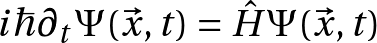
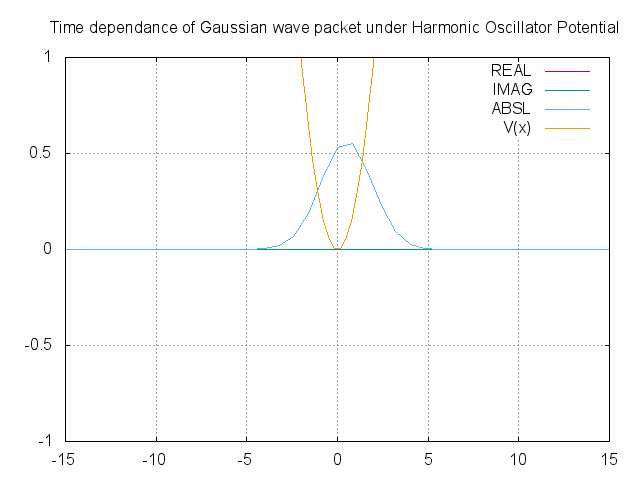
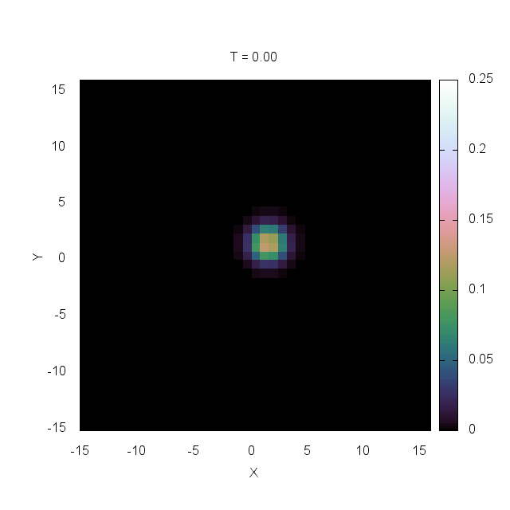
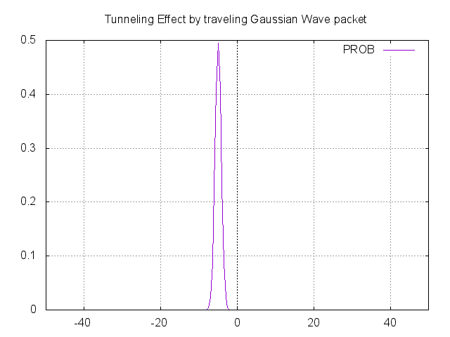

<h1 align="center">
    Quantum Physics Simulations
</h1>

    

    <b>微視的物質のダイナミクスについての第一原理計算</b>
     
    <b>Visualization of every microscopic phenomena based on Schrödinger eq.</b>

---

## About
人間が肉眼で観察することが出来ない微視的な世界では様々な奇異な現象が発生する。
そのような世界の物性・挙動は主に量子力学を用いて記述されるが、用いられる数学は非常に高度なものであり初学者にとっては難解なものである。
本リポジトリでは微視的世界の摩訶不思議な現象をイメージ化することによって理解を助けるのが目的である。
 
Quantum physics is now well established, which led to great successful in multiple fields including Physics, Engineering, and the others.
On the other hand, first learners are still struggling to understand how Quantum World actually behaves mainly because its strangeness and mathematical difficulties.
This repository aims for visualizing the quantum phenomena, helping them to get the feeling of the microscopic world.

## Programs
<table>
<tr><th><h3 style="font-weight: bold;">
    水素原子内における電子の波動関数
     
    Electrons' wave functions inside a Hydrogen Atom
</h3></th></tr><tr><td>

It is well known that electrons inside any atoms are orbiting around its nucleus with Coulomb potential. They have own energy levels so that they can obey the Pauli's principle.  
This program calculates the energy levels by solving the proper Schroedinger Equation.  
There are several ways to solve differential equation with some boundary conditions such as FDM(Finite-Difference Method), and Rungekutta + Bisection Method.  
The picture below shows the wave functions of an electron orbiting around a hydrogen nucleus with orbital quantum number l=1.

</td></tr>

<tr><th><h3 style="font-weight: bold;">
    一次元調和振動子の波動関数
     
    One dimensional Harmonic Oscillator's Wave function
</h3></th></tr><tr><td>

The harmonic oscillator is a system that has many practical uses in quantum and classical mechanics.  
Its force is proportional to its displacement from its equilibrium position, F=-kx, where k is a constant chosen to satisfy this formulation.  
This formula in general, is called Hooke's law.  
In quantum mechanics, Schroedinger equation under this kind of potential gives specified wave function corresponding to its energy levels.  
The sample image shows the case of the 3rd excited state.

</td></tr>

<tr><th><h3 style="font-weight: bold;">
    一次元調和振動子の波動関数の時間発展
     
    Time development of One dimensional Harmonic Oscillator's Wave function
</h3></th></tr><tr><td>

The other program which solves harmonic oscillator schroedinger is not dependent on time.  
Therefore, we couldn't see how the system evolves and behaves.  
This program, however, calculates and predicts how the system evolves under the static harmonic oscillator potential.  
The picture below is how Gaussian wave packet evolves with time.  
You can see that the form of Gaussian wave packet (which resembles to a classical particle) changes according to time, but after one period of time, the shape actually recovers and repeats its periodic movement.

</td></tr>

<tr><th><h3 style="font-weight: bold;">
    三次元調和振動子の波動関数の時間発展
     
    Time development of Three dimensional Harmonic Oscillator's Wave function
</h3></th></tr><tr><td>

Simulate how a wave packet behaves in any potential including harmonic oscillator in three dimensions.  
In order to study how a microscopic particle behaves in real world, thinking in a three dimensional world is important.  
The animation below is the projection of the wave packet trapped inside a harmonic oscillator potential, mapped onto the x-y plane.  

</td></tr>

<tr><th><h3 style="font-weight: bold;">
    無限井戸型ポテンシャル内の波動関数
     
    Wave function with Infinite Wall
</h3></th></tr><tr><td>

The most fundamental model in quantum mechanics is probably this.  
Like most balls thrown into a wall, and bounces in our daily life, if we set an infinite wall-like potential, a particle is trapped inside the potential and bounces the wall back and forth.  
You have probably heard about Tunneling Effect in quantum mechanics, if we set this wall to finite, the result is different.  
The ball (wave of a particle) bounces the finite wall, partially bounces back and other part of the wave actually goes through the finite wall, as if there were no wall in front of them.

</td></tr>

<tr><th><h3 style="font-weight: bold;">
    トンネル効果
     
    Tunnelling effect
</h3></th></tr><tr><td>

A particle which is acted on a finite wall potential, partially goes through the wall in quantum mechanics.  
People may wonder why this happens and doubt if it makes sense.  
However, please remind that in quantum mechanics, there's fundamental law called "Uncertainty principle of energy" which indicates that energy can be infinitesimal or infinite.  
According to this law, if the potential wall has finite height, the wave function can go through the wall and finite existence probability of the particle can be found in the other side of the finite wall.  
This phenomenon ("Quantum Tunneling Effect") was discovered by a Japanese Physicist, Leo Esaki.  

</td></tr>

<tr><th><h3 style="font-weight: bold;">
    原子核内の核子(中性子/陽子)密度の再現
     
    Reproduction of Nucleons' density inside a nucleus
</h3></th></tr><tr><td>

The students who seriously have studied Physics or Chemistry must have heard about nucleus.  
It is the structure inside atoms, which consists of molecules like H2O, CO2, and etc.  
Electrons are orbiting around this core of nucleus, and inside the nucleus, there're protons and neutrons.  
Interestingly, the number of protons only is the key for deciding what particle is this.   
If you add one proton into a nucleus, or remove one, the atom can be entirely different kind of atom, for instance, if you add one proton into a hydrogen nucleus, the hydrogen atom changes its form into a helium atom.  
From what I've said above, the important components of our world can be said to be "Nucleons(Protons/Neutrons)".  
These nucleons form nucleus, then nuclei form molecules, and molecules form the basics of our world.  
The key to solve this interesting, but mysterious structure of nucleus, is to solve Schroedinger equation with appropriate potential.  
Woods-Saxon potential which well satisfies the experimental data phenomenologically is a good example to implement by early learners of Nuclear Physics.  

<table>
<tr><th>
Wave functions of Nucleons in 208 Pb(Lead) Nucleus  
</td></tr>
<tr><td>

</td></tr><tr><th>
Nucleons' Density In 16 Oxygen Nucleus  
</th></tr><tr><td>

</td></tr><tr><th>
Nucleons' Density In 40 Calcium Nucleus  
</th></tr><tr><td>

</td></tr><tr><th>
Nucleons' Density In 208 Pb(Lead) Nucleus  
</th></tr><tr><td>

 

</td></tr><tr><th>
    魔法数 (Magic Number)
</th></tr><tr><td>
There is a fancy word in Nuclear Physics called "Magic Numbers" which indicates the number of nucleons, 2, 8, 20, 28, 50, 82, 126.  
Nucleons whose number matches one of these are mostly stable because there's huge energy gap between an energy level which corresponds to each of these nucleon numbers and the next energy level.  
By applying Woods-Saxon potential into the Schroedinger equation and calculation gives expected, but interesting result.  
</td></tr><tr><td>

 

</td></tr></table></td></tr></table>
