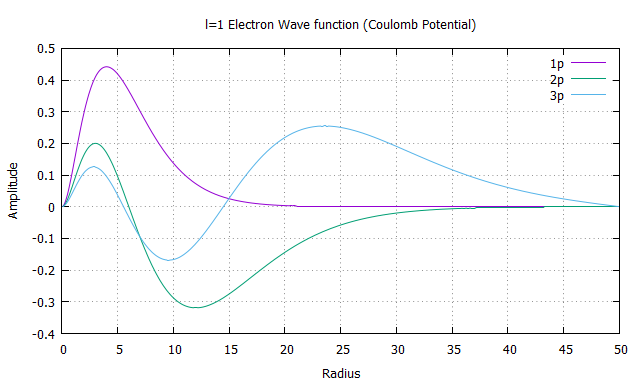
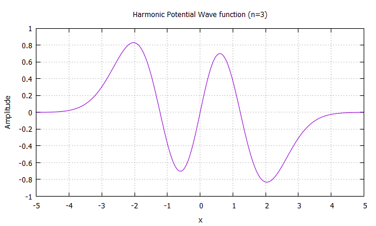
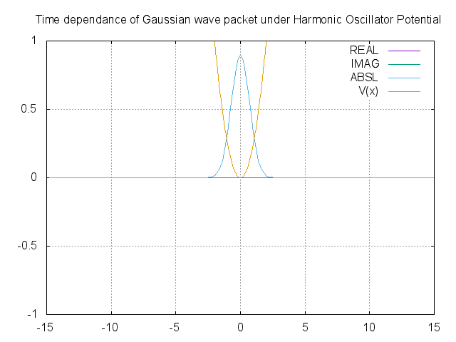
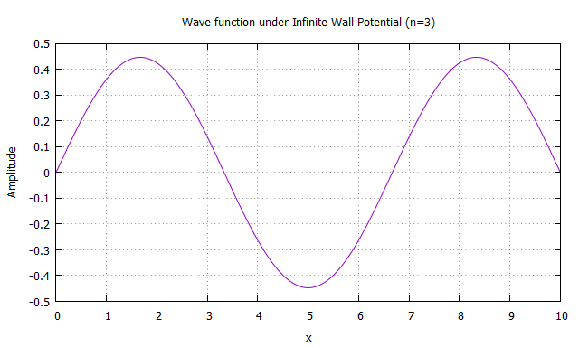
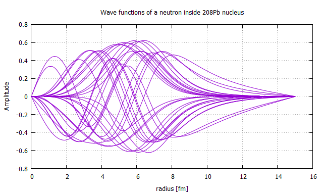
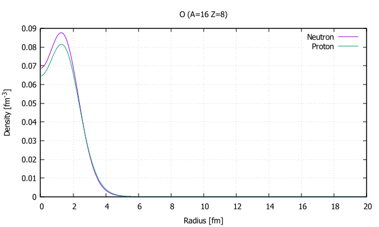
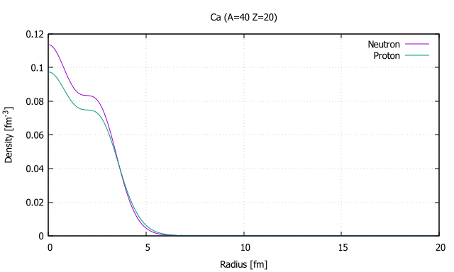
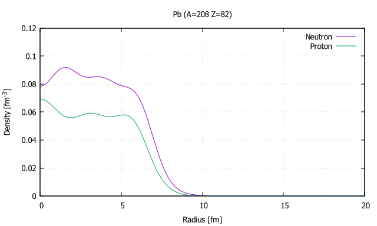

# wave-function
This repository contains various programs used for calculating Schroedinger Equation
* Electron_Energies_Wavefunctions  
It is well known that electrons inside any atoms are orbiting around its nucleus with Coulomb potential. They have own energy levels so that they can obey the Pauli's principle.  
This program calculates the energy levels by solving the proper Schroedinger Equation.  
There are several ways to solve differential equation with some boundary conditions such as FDM(Finite-Difference Method), and Rungekutta + Bisection Method.  
The picture below shows the wave functions of an electron orbiting around a hydrogen nucleus with orbital quantum number l=1.  

* Harmonic_Energies_Wavefunctions  
The harmonic oscillator is a system that has many practical uses in quantum and classical mechanics.  
Its force is proportional to its displacement from its equilibrium position, F=-kx, where k is a constant chosen to satify this formulation.  
This formula in general, is called Hooke's law.  
In quantum mechanics, Schroedinger equation under this kind of potential gives specified wave function corresponding to its energy levels.  
The sample image shows the case of the 3rd excited state.

* Harmonic_TimeEvolution_Wavefunctions  
The other program which solves harmonic oscillator schroedinger is not dependent on time.  
Therefore, we couldn't see how the system evolves and behaves.  
This program, howver, calculates and predicts how the system evolves under the static harmonic oscillator potential.  
The picture below is how Gaussian wave packet evolves with time.  
You can see that the form of Gaussian wave packet (which resembles to a classical particle) changes according to time, but after one period of time, the shape actually recovers and repeats its periodic movement.

* InfiniteWall_Energies_Wavefunctions  
The most fundamental model in quantum mechanics is probably this.  
Like most balls thrown into a wall, and bounces in our daily life, if we set an infinite wall-like potential, a particle is trapped inside the potential and bounces the wall back and forth.  
You have probably heard about Tunneling Effect in quantum mechanics, if we set this wall to finite, the result is different.  
The ball (wave of a particle) bounces the finite wall, partially bounces back and other part of the wave actually goes through the finite wall, as if there were no wall in front of them.

* Nuclei_Density_Energies_ShellModel  
The students who seriously have studied Physics or Chemistry must have heard about nucleus.  
It is the structure inside atoms, which consists of molecules like H2O, CO2, and etc.  
Electrons are orbiting around this core of nucleus, and inside the nucleus, there're protons and neutrons.  
Interestingly, the number of protons only is the key for deciding what particle is this.   
If you add one proton into a nucleus, or remove one, the atom can be entirely different kind of atom, for instance, if you add one proton into a hydrogen nucleus, the hydrogen atom changes its form into a helium atom.  
From what I've said above, the important components of our world can be said to be "Nucleons(Protons/Neutrons)".  
These nucleons form nucleus, then nuclei form molecules, and molecules form the basics of our world.  
The key to solve this interesting, but mysterious structure of nucleus, is to solve Schroedinger equation with appropriate potential.  
Woods-Saxon potential which well satisfies the experimental data phenomenologically is a good example to implement by early learners of Nuclear Physics.  
The picture below shows all possible wave functions of 208Pb(Lead).

This picture shows the density of nucleons of 16 Oxygen.

This picture shows the density of nucleons of 40 Calcium.

This picture shows the density of nucleons of 208 Pb(Lead).

There is a fancy word in Nuclear Physics called "Magic Numbers" which indicates the number of nucleons, 2, 8, 20, 28, 50, 82, 126.  
Nucleons whose number matches one of these are mostly stable because there's huge energy gap between an energy level which corresponds to each of these nucleon numbers and the next energy level.  
By applying Woods-Saxon potential into the Schroedinger equation and calculation gives expected, but interesting result.

