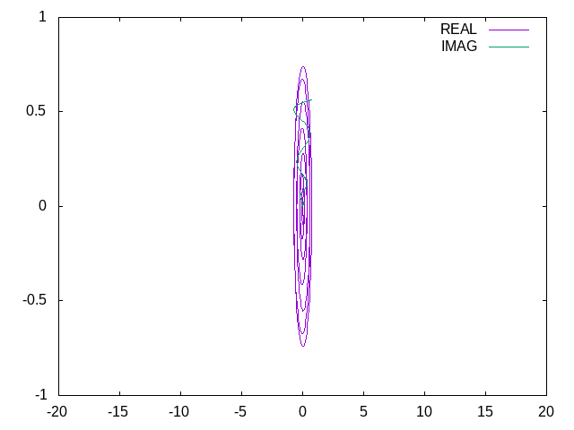

# wave-function
This repository contains various programs used for calculating Schroedinger Equation
* Electron_Energies_Wavefunctions  
It is well known that electrons inside any atoms are orbiting around its nucleus with Coulomb potential. They have own energy levels so that they can obey the Pauli's principle.  
This program calculates the energy levels by solving the proper Schroedinger Equation.  
There are several ways to solve differential equation with some boundary conditions such as FDM(Finite-Difference Method), and Rungekutta + Bisection Method.  
The picture below shows the wave functions of an electron orbiting around a hydrogen nucleus with orbital quantum number l=1.  

* Harmonic_Energies_Wavefunctions

* Harmonic_TimeEvolution_Wavefunctions

* InfiniteWall_Energies_Wavefunctions

* Nuclei_Density_Energies_ShellModel

