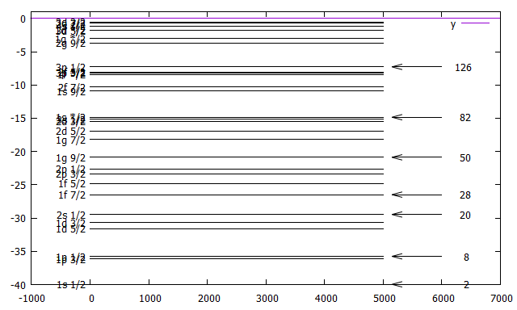

<h1 align="center">
    Quantum Physics Simulations
</h1>

    

     
    <b>Visualization of every microscopic phenomena based on Schrödinger equation.</b>

---

## About
Quantum physics is now well established, which led to great success in multiple fields including Physics, Engineering, and the others.
On the other hand, first learners are still struggling to understand how Quantum World behaves mainly because of its strangeness and mathematical difficulties.
This repository aims for visualizing the quantum phenomena, helping them to get the feeling of the microscopic world.

## Programs
<table>
<h3>
    Electrons' wave functions inside a Hydrogen Atom
</h3>

Electrons are orbiting around the nucleus.
Each state has an energy level due to Pauli's principle.  
This program calculates the energy levels by solving the proper Schroedinger Equation.  
There are several ways to solve differential equation with some boundary conditions such as FDM(Finite-Difference Method), and Rungekutta + Bisection Method.  
The picture below shows the wave functions of an electron orbiting around a hydrogen nucleus with orbital quantum number l=1.

    

<h3>
    One dimensional Harmonic Oscillator's Wave function
</h3>

The harmonic oscillator is a system that has many practical uses in quantum and classical mechanics.  
Its force is proportional to its displacement from its equilibrium position, F=-kx, where k is a constant chosen to satisfy this formulation.  
This formula, in general, is called Hooke's law.  
In quantum mechanics, the Schroedinger equation under this kind of potential gives specified wave function corresponding to its energy levels.  
The sample image shows the case of the 3rd excited state.

<h3>
    Time development of One dimensional Harmonic Oscillator's Wave function
</h3>

It solves harmonic oscillator schroedinger is not dependent on time.  
Therefore, we couldn't see how the system evolves and behaves.  
This program, however, calculates and predicts how the system evolves under the static harmonic oscillator potential.  
The picture below is how the Gaussian wave packet evolves with time.  
You can see that the form of Gaussian wave packet (which resembles to a classical particle) changes according to time, but after one period of time, the shape actually recovers and repeats its periodic movement.

<h3>
    Time development of Three dimensional Harmonic Oscillator's Wave function
</h3>

Simulate how a wave packet behaves in any potential including harmonic oscillator in three dimensions.  
To study how a microscopic particle behaves in the real world, thinking in a three-dimensional world is important.  
The animation below is the projection of the wave packet trapped inside a harmonic oscillator potential, mapped onto the x-y plane.  

<h3>
    Wave function with Infinite Wall
</h3>

The most fundamental model in quantum mechanics is probably this.  
Like most balls thrown into a wall, and bounces in our daily life, if we set an infinite wall-like potential, a particle is trapped inside the potential and bounces the wall back and forth.  
You have probably heard about Tunneling Effect in quantum mechanics, if we set this wall to finite, the result is different.  
The ball (wave of a particle) bounces the finite wall, partially bounces back and other part of the wave actually goes through the finite wall, as if there were no wall in front of them.

<h3>
    Tunnelling effect
</h3>

A particle which is acted on a finite wall potential, partially goes through the wall in quantum mechanics.  
People may wonder why this happens and doubt if it makes sense.  
However, please remind that in quantum mechanics, there's fundamental law called the "Uncertainty principle of energy" which indicates that energy can be infinitesimal or infinite.  
According to this law, if the potential wall has finite height, the wave function can go through the wall and the finite existence probability of the particle can be found on the other side of the finite wall.  
This phenomenon ("Quantum Tunneling Effect") was discovered by a Japanese Physicist, Leo Esaki.  

<h3>
    Reproduction of Nucleons' density inside a nucleus
</h3>

Nucleus is the structure inside atoms, which consists of molecules like H2O, CO2, etc.  
Electrons are orbiting around this core of the nucleus, and inside the nucleus, there're protons and neutrons.  
Interestingly, the number of protons only is the key to deciding what particle is this.   
If you add one proton into a nucleus or remove one, the atom can be an entirely different kind of atom, for instance, if you add one proton into a hydrogen nucleus, the hydrogen atom changes its form into a helium atom.  
From what I've said above, the important components of our world can be said to be "Nucleons(Protons/Neutrons)".  
These nucleons make a nucleus, then nuclei form molecules, and molecules form the basics of our world.  
The key to solving this interesting, but the mysterious structure of the nucleus, is to solve the Schroedinger equation with appropriate potential.  
The Woods-Saxon potential which well satisfies the experimental data phenomenologically is a good example to implement by early learners of Nuclear Physics.  

<b>Wave functions of Nucleons in 208 Pb(Lead) Nucleus</b> 

 
<b>Nucleons' Density In 16 Oxygen Nucleus</b> 

 
<b>Nucleons' Density In 40 Calcium Nucleus</b> 

 
<b>Nucleons' Density In 208 Pb(Lead) Nucleus</b> 
 

<h4>Magic Number</h4>
There is a fancy word in Nuclear Physics called "Magic Numbers" which indicates the number of nucleons, 2, 8, 20, 28, 50, 82, 126.  
Nucleons whose number matches one of these are mostly stable because there's a huge energy gap between an energy level which corresponds to each of these nucleon numbers and the next energy level.  
By applying Woods-Saxon potential into the Schroedinger equation and calculation gives expected, but interesting result.  
 
 
